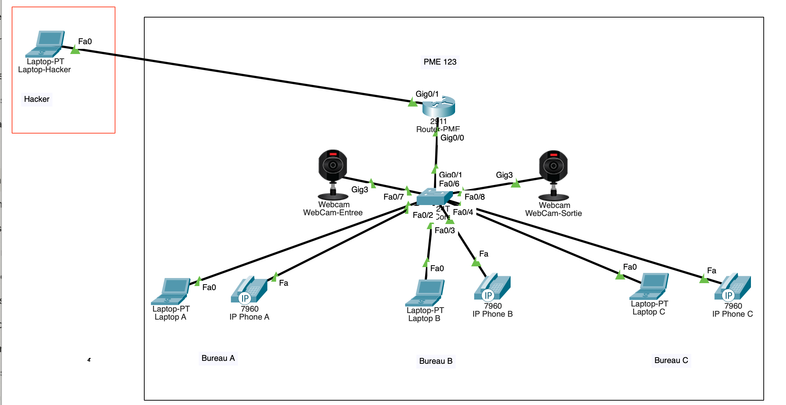
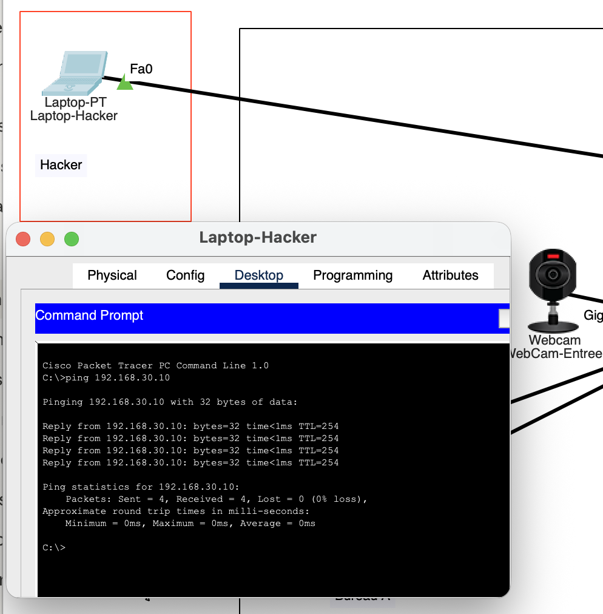
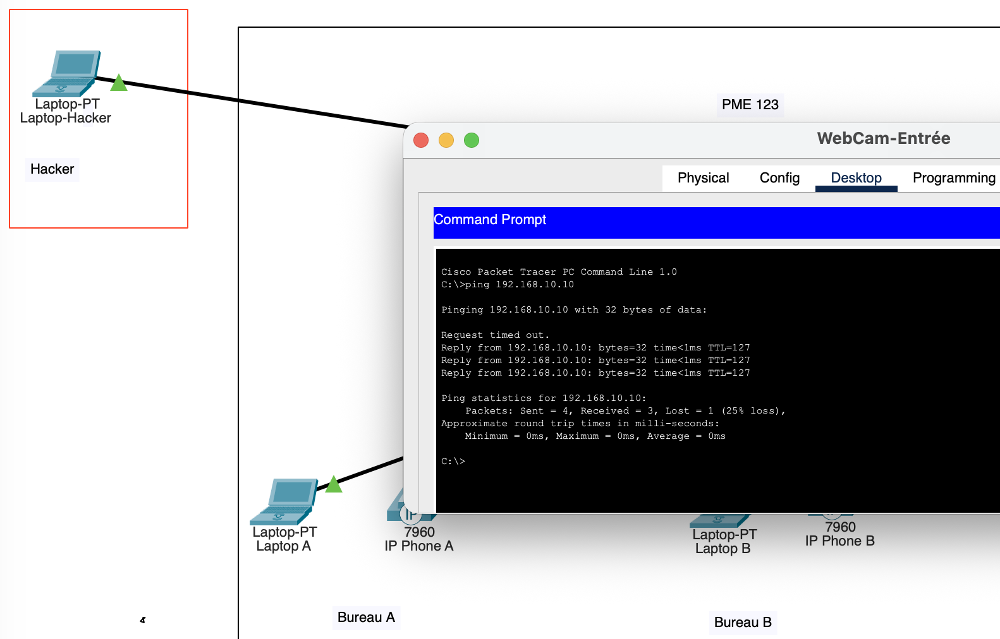
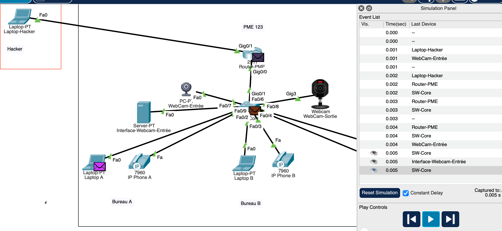
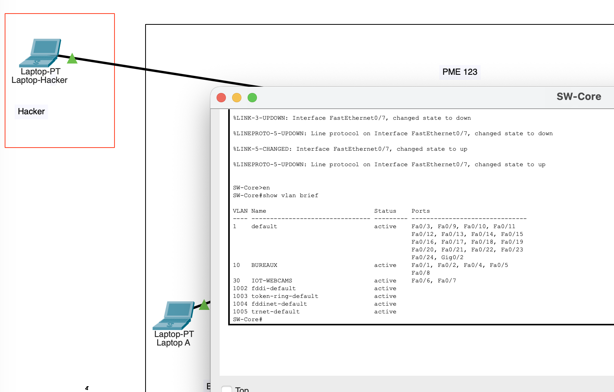

# Attaque IoT sur un réseau de PME — Cisco Packet Tracer Lab


## Présentation

Ce lab simule un scénario d'attaque réaliste ciblant le réseau d'une Petite et Moyenne Entreprise (PME) via des objets connectés (IoT) mal sécurisés — plus précisément des caméras IP exposées sur Internet sans segmentation réseau adéquate.

L'objectif est de démontrer, dans un environnement pédagogique contrôlé, comment un attaquant peut :

   1. Atteindre une caméra IP directement depuis Internet (absence de règles de pare-feu bloquant les flux IoT)

   2. Accéder à l'interface d'administration de la caméra via des identifiants par défaut

   3. Réaliser un pivot (mouvement latéral) à travers le réseau interne pour atteindre les postes de travail et les téléphones VoIP

> **Avertissement** — See [DISCLAIMER.md](DISCLAIMER.md). TCe lab est strictement éducatif. Toutes les simulations sont effectuées dans Cisco Packet Tracer — aucun système réel n'est impliqué.

---

## Topologie Réseau



### Plan d'adressage

| Segment | VLAN | Sous-réseau | Passerelle |
|---|---|---|---|
| Workstations (bureaux) | VLAN 10 | 192.168.10.0/24 | 192.168.10.1 |
| IoT / IP Cameras | VLAN 30 | 192.168.30.0/24 | 192.168.30.1 |
| WAN (simulé) | — | 203.0.113.0/30 | — |

### Equipements

| Equipement | Adresse IP | Rôle |
|---|---|---|
| Router-PME | 192.168.10.1 / 192.168.30.1 / 203.0.113.1 | Passerelle |
| SW-Core | — | Core switch (VLANs 10 & 30) |
| Laptop-A/B/C | 192.168.10.10–12 | Postes de travail (VLAN 10) |
| IP Phone-A/B/C | 192.168.10.20–22 | Téléphones IP VoIP IP (VLAN 10) |
| Webcam-Entree | 192.168.30.10 | IP Camera — point d'entrée (VLAN 30) |
| Webcam-Sortie | 192.168.30.11 | IP Camera — sortie (VLAN 30) |
| Serveur-Webcam | 192.168.30.50 | Interface HTTP simulée |
| Hacker-External | 203.0.113.2 | Attaquant externe (WAN) |

> **Note sur le lab ** — La caméras IP entrée est simulée par un PC standard avec une icône de caméra. Un serveur HTTP dédié (192.168.30.50) simule le panneau d'administration, une pratique courante dans Packet Tracer car les objets IoT "Home" natifs ne disposent pas de service HTTP paramétrable..

---

## Scénario d'attaque en 4 Phases

### Phase 1 - Reconnaissance
L'attaquant scanne l'IP publique de la PME. Le port 80 du serveur d'admin des webcams est accessible directement depuis Internet — aucune règle de pare-feu ne bloque le trafic WAN → IoT.

```
Hacker-External# ping 192.168.30.10   → Reply  ✅
Hacker-External# ping 192.168.30.50   → Reply  ✅
```



### Phase 2 - Accès à l'interface d'administration
L'attaquant ouvre un navigateur et se rend sur `http://192.168.30.50`. TLe panneau d'administration se charge avec les identifiants par défaut (admin/admin) toujours actifs: une erreur de configuration critique présente sur de nombreuses caméras IP grand public.

### Phase 3 - Mouvement latéral (Pivot VLAN)
En l'absence de filtrage ACL entre le VLAN 30 (IoT) et le VLAN 10 (postes de travail), l'attaquant pivote depuis le segment compromis vers le réseau interne des bureaux.

```
Webcam-PC# ping 192.168.10.10   → Reply  ✅  (Laptop-A reached)
Webcam-PC# ping 192.168.10.20   → Reply  ✅  (Phone-A reached)
```



### Phase 4 - Impact Interne
Depuis le VLAN IoT, l'attaquant peut désormais atteindre tous les postes de travail et téléphones VoIP. Le trafic SIP entre les téléphones n'est pas chiffré (UDP 5060) — ce qui permet l'écoute clandestine. Les partages de fichiers et services internes sont exposés.



---

## VVulnérabilités démontrées

| # | Vulnerabilité | Impact | Référence CWE |
|---|---|---|---|
| 1 | Équipements IoT exposés sur le WAN | L'attaquant atteint les caméras directement | CWE-284 |
| 2 | Identifiants par défaut non modifiés (admin/admin) | Accès admin total à l'interface caméra| CWE-1392 |
| 3 | Absence de segmentation VLAN / ACL | Mouvement latéral de l'IoT vers les PCs | CWE-923 |
| 4 | VoIP non chiffrée (SIP UDP 5060) | Interception d'appels possible depuis le LAN | CWE-311 |



---

## Mesures de remédiation recommandées

**1. Règles de pare-feu: bloquer WAN → IoT**
```
ip access-list extended BLOCK-WAN-TO-IOT
 deny ip any 192.168.30.0 0.0.0.255
 permit ip any any
interface GigabitEthernet0/1
 ip access-group BLOCK-WAN-TO-IOT in
```

**2. Modification des identifiants par défaut**
Appliquer une politique de mots de passe robustes sur tous les équipements IoT dès le déploiement. Maintenir un inventaire des firmwares et un planning de mise à jour.

**3. Isolation du VLAN IoT via ACL**
```
ip access-list extended BLOCK-IOT-TO-LAN
 deny ip 192.168.30.0 0.0.0.255 192.168.10.0 0.0.0.255
 permit ip any any
interface GigabitEthernet0/0.30
 ip access-group BLOCK-IOT-TO-LAN in
```

**4. Chiffrement du trafic VoIP**
Déployer SRTP + TLS sur tous les téléphones IP. Utiliser l'authentification de port 802.1X sur les switchs d'accès.

---

## Comment utiliser ce lab

### Prérequis
- Cisco Packet Tracer 9.0.0 ou version ultérieure (téléchargement gratuit sur [netacad.com](https://www.netacad.com))

### Etapes
1. Cloner ce dépôt
2. Ouvrir `pme_iot_attack.pkt` dans Packet Tracer
3. La topologie se charge en mode **Realtime** ,  tous les liens doivent être verts
4. Pour rejouer la simulation d'attaque : passer en mode **Simulation**(en bas à droite)
5. Cliquer sur **Play** et oobservez les paquets ICMP traverser le réseau depuis Hacker-External jusqu'à Laptop-A sans aucun filtrage

### Reproduire l'attaque manuellement
```
1. Depuis Hacker-External → ping 192.168.30.10  (joindre la webcam)
2. Depuis Hacker-External → ouvrir http://192.168.30.50  (admin panel)
3. Depuis la Webcam-PC → ping 192.168.10.10  (pivot vers poste de travail)
```

---

## Limites du lab

Ce lab est conçu dans Cisco Packet Tracer, qui présente certaines limitations par rapport à un environnement réel ou GNS3:

- Pas d'exploitation réelle de firmware: les attaques basées sur les CVE sont décrites conceptuellement.
- La caméra IP est simulée par un PC (icône modifiée): —les objets IoT natifs de PKT manquent de terminal et de service HTTP.
- Pas de simulation IDS/IPS.
- Le trafic SIP n'est pas intégralement décodé en mode simulation.

Une suite logique pour ce lab serait de le reconstruire sous **GNS3 + machines virtuelles** (Kali Linux pour l'attaquant, firmware IoT vulnérable en VM) pour démontrer une exploitation réelle.

---

## Compétences démontrées

`Network segmentation` `VLAN configuration` `Inter-VLAN routing` `Access Control Lists` `IoT security` `Threat modelling` `Cisco IOS CLI` `Packet Tracer simulation`

---

## Réferences

- [NIST SP 800-213 — IoT Cybersecurity Guidance](https://csrc.nist.gov/publications/detail/sp/800-213/final)
- [OWASP IoT Attack Surface Areas](https://owasp.org/www-project-internet-of-things/)
- [CVE-2021-33544 — Webcam default credential exposure](https://nvd.nist.gov/vuln/detail/CVE-2021-33544)
- [Cisco IOS VLAN Security Best Practices](https://www.cisco.com/c/en/us/support/docs/lan-switching/8021q/17056-741-4.html)

---

*Lab conçu et documenté dans le cadre d'un projet de portfolio en cybersécurité.*